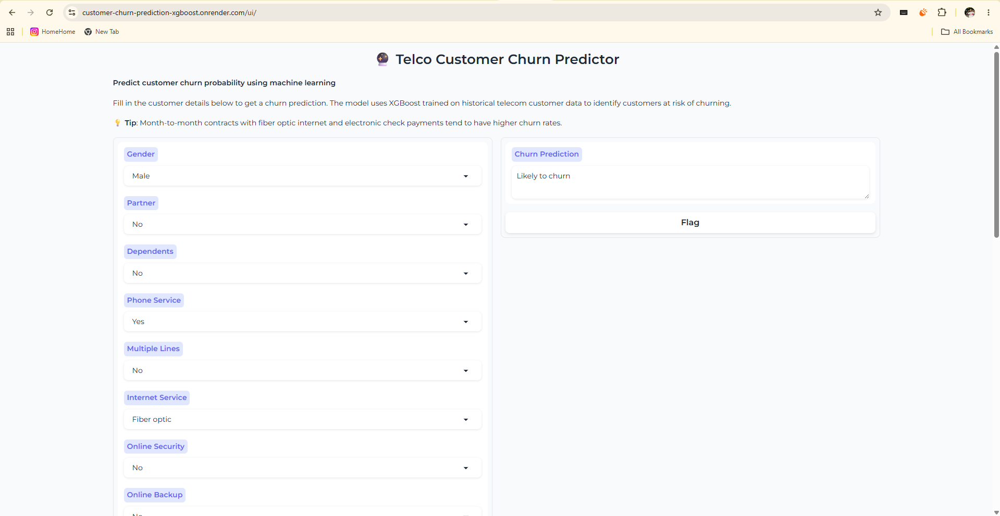

# Telco Customer Churn Prediction

[](https://github.com/kithusibrian/Customer-Churn-Prediction-XGBoost-/actions/workflows/ci.yml)
[](https://customer-churn-prediction-xgboost.onrender.com/ui/)
[](https://www.python.org/)
[](https://www.docker.com/)



An end-to-end machine-learning application that predicts whether a telecom customer is likely to churn. It combines an XGBoost classification model with a FastAPI prediction API and a Gradio interface for non-technical users.

**Live application:** [Open the churn predictor](https://customer-churn-prediction-xgboost.onrender.com/ui/)

**API documentation:** [OpenAPI / Swagger UI](https://customer-churn-prediction-xgboost.onrender.com/docs)

## What it does

The model evaluates customer demographics, subscribed services, contract details, and billing information to return one of two outcomes:

- `Likely to churn`
- `Not likely to churn`

This makes the model useful for identifying customers who may benefit from retention outreach, tailored offers, or proactive support.

## Business value

Customer-success or retention teams can use the output to prioritize outreach rather than treating every account the same. A practical workflow is:

```text
Customer data -> churn prediction -> priority list -> retention action -> outcome review
```

For example, a customer predicted as likely to churn could be reviewed for a contract offer, billing support, service-quality investigation, or proactive customer-care contact. Predictions should support human decisions, not replace them.

## Live endpoints

| Endpoint   | Method | Purpose                                        |
| ---------- | ------ | ---------------------------------------------- |
| `/`        | `GET`  | Health check; returns `{"status":"ok"}`        |
| `/predict` | `POST` | Returns a churn prediction for one customer    |
| `/ui`      | `GET`  | Interactive Gradio interface                   |
| `/docs`    | `GET`  | Auto-generated FastAPI / OpenAPI documentation |

The application is hosted on Render's free web-service tier. Free services can sleep after inactivity, so the first request after a period of no traffic may take up to about a minute to respond.

## Example API request

```bash
curl -X POST "https://customer-churn-prediction-xgboost.onrender.com/predict" \
  -H "Content-Type: application/json" \
  -d '{
    "gender": "Female",
    "Partner": "No",
    "Dependents": "No",
    "PhoneService": "Yes",
    "MultipleLines": "No",
    "InternetService": "Fiber optic",
    "OnlineSecurity": "No",
    "OnlineBackup": "No",
    "DeviceProtection": "No",
    "TechSupport": "No",
    "StreamingTV": "Yes",
    "StreamingMovies": "Yes",
    "Contract": "Month-to-month",
    "PaperlessBilling": "Yes",
    "PaymentMethod": "Electronic check",
    "tenure": 1,
    "MonthlyCharges": 85.0,
    "TotalCharges": 85.0
  }'
```

Example response:

```json
{
  "prediction": "Likely to churn"
}
```

### PowerShell example

```powershell
$customer = @{
  gender = "Female"; Partner = "No"; Dependents = "No"
  PhoneService = "Yes"; MultipleLines = "No"
  InternetService = "Fiber optic"; OnlineSecurity = "No"; OnlineBackup = "No"
  DeviceProtection = "No"; TechSupport = "No"; StreamingTV = "Yes"; StreamingMovies = "Yes"
  Contract = "Month-to-month"; PaperlessBilling = "Yes"; PaymentMethod = "Electronic check"
  tenure = 1; MonthlyCharges = 85.0; TotalCharges = 85.0
}

Invoke-RestMethod `
  -Uri "https://customer-churn-prediction-xgboost.onrender.com/predict" `
  -Method Post `
  -ContentType "application/json" `
  -Body ($customer | ConvertTo-Json)
```

## Model performance

The packaged XGBoost model is tracked with MLflow. Its recorded holdout-set metrics are:

| Metric    | Score |
| --------- | ----: |
| ROC-AUC   | 0.837 |
| Recall    | 0.821 |
| F1 score  | 0.614 |
| Precision | 0.490 |

Recall is particularly useful in this use case because it measures how effectively the model identifies customers who actually churned. Metrics should be re-evaluated whenever the model or its training data changes.

## Dataset

This project uses the **IBM Telco Customer Churn sample dataset**, which contains **7,043 customer records**. Each record describes a telecom customer across several areas:

- **Demographics:** gender, partner status, and dependents
- **Services:** phone, internet, security, backup, device protection, technical support, and streaming services
- **Account details:** tenure, contract type, paperless billing, and payment method
- **Billing:** monthly charges and total charges
- **Target:** `Churn`, indicating whether the customer left the service (`Yes` or `No`)

The dataset is used to train and evaluate the churn-classification model and to demonstrate how customer attributes can support retention prioritization. Before modeling, the pipeline validates the input, converts numeric fields, applies deterministic binary mappings, one-hot encodes categorical fields, and aligns the resulting feature columns with the packaged model. The raw file is expected at:

```text
data/raw/Telco-Customer-Churn.csv
```

The preprocessing workflow writes the cleaned dataset to `data/processed/telco_churn_processed.csv`.

## Data and feature processing

The model uses 18 customer attributes grouped into the following categories:

| Feature group       | Examples                                                                                                 |
| ------------------- | -------------------------------------------------------------------------------------------------------- |
| Demographics        | Gender, partner status, dependents                                                                       |
| Phone services      | Phone service, multiple lines                                                                            |
| Internet services   | Internet service, online security, backup, device protection, technical support, streaming TV and movies |
| Account and billing | Contract type, paperless billing, payment method                                                         |
| Numeric measures    | Tenure, monthly charges, total charges                                                                   |

The target is a binary churn outcome: whether a customer leaves the service. During training, the data is split into an 80% training set and a 20% evaluation set with a fixed random seed of `42`. The serving pipeline converts numeric values, applies deterministic binary mappings, one-hot encodes categorical fields, and aligns the resulting columns with the feature order stored alongside the model.

## Model card

### Intended use

Use this application to demonstrate churn-risk classification, explore individual customer scenarios, and support retention prioritization alongside business review.

### Not intended for

- Automatically cancelling, denying, or changing a customer's service.
- Making decisions without human review.
- Treating the binary output as a calibrated probability or financial recommendation.

### Limitations and risks

- Historical customer data can contain gaps or biases that the model may learn.
- A false positive can send unnecessary retention effort to a customer who would have stayed.
- A false negative can miss a customer who is about to leave.
- Customer behavior, pricing, and products change over time; this can reduce model quality after deployment.

Review model performance by relevant customer segments, monitor real-world outcomes, and retrain only after validating new data and metrics.

## Technology stack

| Area                                    | Technology                           |
| --------------------------------------- | ------------------------------------ |
| Machine learning                        | XGBoost, scikit-learn, pandas, NumPy |
| Experiment tracking and model packaging | MLflow                               |
| API                                     | FastAPI and Pydantic                 |
| User interface                          | Gradio                               |
| Application server                      | Uvicorn                              |
| Containerization                        | Docker with Python 3.11 slim         |
| Deployment                              | Render Web Service                   |
| Automation                              | GitHub Actions and Docker Buildx     |
| Source control                          | Git and GitHub                       |

## Architecture

```text
Customer inputs
      |
      +--> Gradio UI (/ui)
      |
      +--> FastAPI API (/predict)
                    |
                    v
       Feature transformation pipeline
                    |
                    v
       MLflow-packaged XGBoost model
                    |
                    v
          Churn prediction response
```

The same `predict` function powers both the API and the UI, keeping serving behavior consistent across both entry points. The inference pipeline applies binary encoding, one-hot encoding, numeric coercion, and feature alignment in the order expected by the trained model.

## How it was built

```text
Raw customer data
      -> validation and preprocessing
      -> feature engineering
      -> XGBoost training and evaluation
      -> MLflow experiment tracking and model packaging
      -> FastAPI + Gradio serving layer
      -> Docker image
      -> Render deployment
```

## Project structure

```text
.
|-- .github/workflows/ci.yml       # GitHub Actions Docker workflow
|-- dockerfile                     # Container image definition
|-- requirements.txt               # Full development and training dependencies
|-- requirements.production.txt    # Runtime dependencies for the deployed image
`-- src/
    |-- app/main.py                # FastAPI routes and Gradio UI
    |-- data/                      # Data loading and preprocessing modules
    |-- features/                  # Feature engineering utilities
    |-- models/                    # Training, evaluation, and tuning code
    |-- serving/
    |   |-- inference.py           # Production inference pipeline
    |   `-- model/                 # Versioned MLflow model artifacts
    `-- utils/                     # Shared utilities and data validation
```

## Run locally with Docker

Docker is the recommended way to run the application locally because it uses the same packaged model and runtime configuration as production.

```powershell
git clone <your-repository-url>
cd <repository-folder>
docker build --tag telco-churn-app --file dockerfile .
docker run --rm --publish 8000:8000 telco-churn-app
```

Then open:

- `http://localhost:8000/`
- `http://localhost:8000/ui`
- `http://localhost:8000/docs`

## Deployment

The service is deployed as a Docker-based Render Web Service.

1. Push the project to GitHub.
2. In Render, create a **Web Service** connected to the repository.
3. Select the **Docker** runtime and the `main` branch.
4. Render builds the image from `dockerfile` and starts the Uvicorn command declared in it.
5. Render supplies the `PORT` environment variable; the container defaults to port `8000` when run locally.

The Docker image bundles the MLflow model artifacts, so inference does not rely on a separately hosted model registry at runtime.

## CI/CD

The GitHub Actions workflow in `.github/workflows/ci.yml` is configured to build the Docker image and push it to Docker Hub when changes reach `main`. It requires these repository secrets:

- `DOCKERHUB_USERNAME`
- `DOCKERHUB_TOKEN`

Render can independently deploy from the connected GitHub repository.

## Troubleshooting

| Symptom                                           | Likely cause and resolution                                                                                                         |
| ------------------------------------------------- | ----------------------------------------------------------------------------------------------------------------------------------- |
| The deployed app takes a while on its first visit | The free Render service has woken from inactivity. Wait about a minute and retry.                                                   |
| `422 Unprocessable Entity` from `/predict`        | A required field is missing or has an invalid type. Use `/docs` to verify the request schema.                                       |
| Docker cannot find the model                      | Run the build from the repository root so Docker can copy `src/serving/model/`.                                                     |
| Port is unavailable locally                       | Change the host port, for example: `docker run --rm -p 8001:8000 telco-churn-app`.                                                  |
| GitHub Actions Docker job fails at login          | Add `DOCKERHUB_USERNAME` and `DOCKERHUB_TOKEN` as repository secrets, or remove the Docker Hub publishing step if it is not needed. |

## Contributing

Contributions are welcome. For a focused change:

1. Create a branch from `main`.
2. Keep changes scoped and update the README when behavior or deployment instructions change.
3. Verify the container locally with `docker build --tag telco-churn-app --file dockerfile .`.
4. Open a pull request that explains the problem, the change, and how it was verified.

## Future improvements

- Add automated tests for health checks, request validation, and predictions.
- Add structured logging and return proper HTTP 5xx responses for inference failures.
- Pin every model-runtime dependency to the model artifact's compatible environment.
- Add request monitoring and model-performance monitoring.
- Retrain and evaluate the model periodically as customer behavior changes.

## License

Add a license file before distributing or reusing this project publicly.
